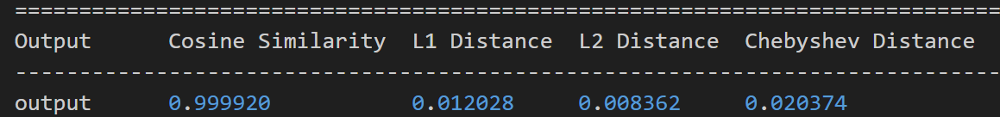

# 1. Project Introduction


To celebrate the 2025 1024 Programmer's Day, D-Robotics × Coze jointly launched the "Vibe Coze Hackathon 2025" - integrating end-cloud with "robot + Coze", leveraging Coze's communication advantages, collaborating with top-tier media and KOLs from leading platforms such as high-quality universities, AI communities, Bilibili, Douyin, Rednote, etc., to promote D-Robotics's brand influence and market recognition in the AI field and the Internet of Things, and to build a technological image of "end-cloud integration + multi-model series connection". The event will be held from October 24 to November 30, 2025.&#x20;


The goal of this Hackathon is to attract creative works from outstanding developers, and this project is an example project to guide developers in their development. This project implements a "cloud-edge collaboration" chat game robot Demo, where&#x20;**&#x20;the cloud&#x20;**&#x20;is responsible for running large language models (LLMs), handling natural language understanding and dialogue generation, and providing rich chat capabilities. The local (edge device: RDK X5) runs a reinforcement learning model (DQN) deployed on the BPU, deploys and runs a small game (a variant of the MountainCar environment) in real time on the local environment, achieving low-latency interactive control and immediate feedback.&#x20;


The goal is to combine "companion chat" with "interactive mini-games": users can engage in daily conversations with the robot while triggering and participating in a simple reinforcement learning mini-game to receive immediate visual/voice feedback and interactive experiences. The inspiration comes from the Cocomo companion robot at MakerFaire Tokyo in Japan, which not only chats but also performs tasks, follows, and plays with users.&#x20;


# 2. Features and Highlights

This case provides a standard template for this Hackathon, as well as ideas for combining cloud-edge-end models, with the following features and highlights:&#x20;

1. **Edge-Cloud Collaborative Architecture**: The cloud is responsible for language understanding and complex generation, while the local end is responsible for real-time control and RL inference, achieving a balance of experience that is "both powerful and low-latency".

2. **Deploy DQN on RDK X5**: Export the trained DQN model and deploy it to edge hardware (RDK X5), then run it on a real or simulated MountainCar environment as a mini-game kernel.

3. **Seamless integration of chat and games&#x20;**: During the chat, the robot can initiate small game invitations, explain the game situation, provide encouragement or strategic tips, making the conversation more interactive and interesting.&#x20;

4. **Lightweight Deployment and Real-time Interaction**: Local inference and environment operation ensure low-latency response to user input (keystrokes, touchscreen, voice commands), improving User Experience.

5. **Scalable Interaction Modes**: In addition to MountainCar, it can be extended to more small-scale reinforcement learning environments or somatosensory interactions (such as simple following, obstacle avoidance mini-games, etc.).


# 3. Technical Details

## 3.1 System Architecture

Specifically, the system architecture can be divided into:

1. **Cloud LLM Service**: Responsible for dialogue understanding, generation, strategy prompt statements, game rule explanations, non-real-time strategy recommendations, etc.

2. **Local Agent (RDK X5)**: Receives cloud commands and local user input, runs DQN inference to control the MountainCar environment, and postbacks the environment state/reward to the front end and cloud (for display and logging).

3. **Communication**: Uses lightweight protocols (such as WebSocket/HTTP REST), and messages include conversation context, game state, control commands, model logs, etc.


## 3.2 Board End Model Deployment

We convert and deploy the DQN model through the toolchain.

Among them, we choose the version of the toolchain as follows:

hbdk version 3.49.9

horizon\_nn version 1.1.0

hb\_mapper version 1.24.3

After converting the trained model, the following results and accuracy are obtained:&#x20;



It can be seen that the model output is basically consistent with the original model, both exceeding 0.9999&#x20;

For the deployment efficiency of this DQN small model, we use the following command.&#x20;

We first overclock the RDK X5:&#x20;

```bash
# 8核心CPU全核心1.8GHz，Performance调度
sudo bash -c "echo 1 > /sys/devices/system/cpu/cpufreq/boost"
sudo bash -c "echo performance > /sys/devices/system/cpu/cpufreq/policy0/scaling_governor"
# BPU超频到1.2GHz
echo 1200000000 > /sys/kernel/debug/clk/bpu_mclk_2x_clk/clk_rate
```

We then use the following command for testing&#x20;

```plain&#x20;text
hrt_model_exec perf --model_file car_dqn_output.bin --frame_count 100 --thread_num 1
```

Among them, the frame\_count parameter indicates how many frames we select for testing, and we keep 100 frames for testing. The thread\_num parameter indicates how many threads we select for testing, and we change this parameter to obtain the following table:

| Number of threads | Total frame number | Total Delay (ms) | Average Delay (ms)  | FPS     |
| ----------------- | ------------------ | ---------------- | ------------------- | ------- |
| 1                 | 100                | 34.15            | 0.34                | 2850.22 |
| 2                 | 100                | 40.22            | 0.40                | 4736.42 |
| 4                 | 100                | 48.41            | 0.48                | 7607.45 |
| 8                 | 100                | 80.16            | 0.80                | 8452.37 |

The accuracy after quantization is based on whether the car can successfully climb the hill, and if it can successfully complete the task on X5, it is considered a success. The result is that the deployment on X5 was successful.&#x20;

For other metrics, we examine their bandwidth and BPU utilization.

We use the BPU utilization:

```plain&#x20;text
hrut_somstatus
```

Checked and obtained the following:&#x20;


BPU utilization rate: 9%&#x20;

For bandwidth, we use the command:

```plain&#x20;text
hrut_ddr -p 1000 -t all
```

Obtain the following


Both bandwidth read and write occur on the BPU, with relatively low occupancy

## 3.3 Operating Process

The project is relatively simple to run. First, we ensure that the RDK X5 is correctly connected to the network, and then we open MobaXTerm and enter the project directory.&#x20;

Install relevant dependencies:&#x20;

```plain&#x20;text
pip install -r requirements.txt
```

```plain&#x20;text
pip install bpu_infer_lib_x3-1.0.3-py3-none-any.whl
```

After completing the dependency installation, we need to fill in the API TOKEN, BOT\_ID, and USER\_ID of the button in the code&#x20;


After completing the form, we can run it in MobaXTerm to start a conversation:&#x20;

```plain&#x20;text
python play_with_coze.py
```

When the keyword "game" is triggered, enter the reinforcement learning mini-game.&#x20;

When the input is \`exit\`, the program will exit.&#x20;
